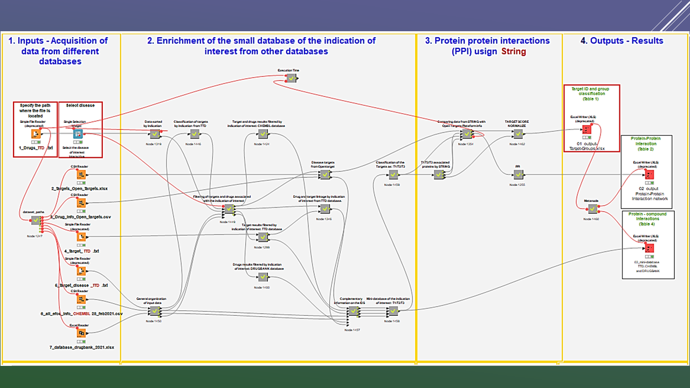

## *Welcome to the Ramirez Lab Wiki – Protein-Protein Interactions Networks (PPI) for key targets in a given disease*

Here we present a workflow constructed in KNIME (an open source software) which can be used to capture relevant information related to an indication of interest involving (1) a complete list of targets,  (2) drug names, and their respective study phase, and (3) key protein-protein interactions. 
This workflow is fed with different databases for the systemic capture of the growing number of approved drugs in clinical trials, as well as drugs currently in research, along with their target and indication.  These include, for example, <a href="https://www.ebi.ac.uk/chembl" target="_blank"><b>ChEMBL</b></a></b>, <b><a href="http://db.idrblab.net/ttd/" target="_blank">Therapeutic Target Database TTD</a></b>, <b><a href="https://go.drugbank.com/" target="_blank"<b>DRUGBANK</b></a>, <b><a href="https://string-db.org/" target="_blank"<b>STRING</b></a> and <b><a href="https://www.opentargets.org/" target="_blank"<b>OPEN TARGETS</b></a>, which have stood out as efficient, cost-effective, and complementary tools for target and drug discovery and prioritization. The integration of these different databases through this Workflow contributes to the selection and prioritization of targets mapped and the identification of a new set of proteins as drug target candidates, thus increasing the probability of significantly affecting the right targets which have a relevant biological role, not only for disease treatment but perhaps also in disease prevention. This workflow was trained and validated using Alzheimer's disease as an example.

### Requirements

* Knime version 4.3.1 or higher, a programming software <b><a href="https://www.knime.com/" target="_blank">Knime website</a></b>

* Our Knime workflow which captures key data about an indication of interest using different databases <a href="https://github.com/jdhurtadop2017/Mapping_Targets/raw/master/PPI-network.knwf">**PPI-network**</a>.

* Input files to run the workflow <a href="https://github.com/jdhurtadop2017/Mapping_Targets/raw/master/Inputs/Inputs.rar">**Inputs**</a>

* Output files obtained using Alzheimer's disease as an example for the user to compare results  <a href="https://github.com/jdhurtadop2017/Mapping_Targets/raw/master/Outputs/Outputs.rar"> **Outputs**</a>
  
  Here you can have a complete visualization of the workflow <a href="https://workflowigm.netlify.app/" target="_blank">**Workflow Visualization**</a>
  
  
  
  

###  1. Input - Data acquisition from databases for interaction frequencies calculation.

The following steps describe how to load entries:

* Indicate the path where the file 1_Drugs_TTD.txt (red box) is located on your computer, once the workflow starts running the other input files will be loaded automatically as long as they are located in the same folder as file 1.

  

* Right-clicking the node named Select Disease selects the pathology of interest as well as the Interactive View: single selection widget option.

  

### 2. Data enrichment from various databases

* 
 Data obtained from different databases is processed to filter target proteins and drugs which have been found associated with the indication of interest. In addition, targets are classified according to their related drugs study phase as T1, T2, and T3, meaning:

  T1: Approved drug or Phase 4

  T2: Clinical trials, phase 1, 2, or 3 

  T3: Research phase: completed, preclinical or phase 0

  
Looking to complement the information of the pathology of interest, a query in the Open Targets database is made through the **EFO** (Experimental Factor Ontology), which serves as a disease identifier. Finally, a small, filtered, database of the pathology of interest is obtained, enriched with information from four databases, through the respective IDs of proteins targets and associated drugs. This small database generates the Output Table 3. 
 	

* 
The node titled "T1/T2/T3 Classification" lists the targets classified as T1, T2, and T3 as well as their respective Uniprot ID. The nodes and metanodes used in this workflow are properly documented inside the workflow to describe the processes to be performed.

### 3. Protein-Protein Interactions (PPI) query using STRING database

* 
Once we have identified the targets that we have named T1, T2, and T3, we use the STRING database to integrate to the protein-protein interaction network those targets that are known from experimental evidence and curated databases to have physical interactions or functional associations with the targets T1, T2 and T3. These targets we have named as T4 and are filtered by running a query on the STRING database with the following parameters: 

  Limit = 20, and Required score = 400. 

  
This line indicates that to perform the query, the best 20 targets that interact with the target of interest (either T1/T2/T3) and have an overall score ≥ 0.4 will be extracted to build the PPI network (The overall score is the sum of all known, predicted and other interactions).
 

  
Subsequently, proteins with known interactions are filtered out from experimental data <i><b>escore</b></i> and curated databases (<i><b>dscore</b></i>), with a minimum score and mean confidence of: eScore ≥0.4 or score ≥0.4.  It should be mentioned that in the PPI network those T4 to T4 interactions are also captured if they exist. The PPI network results for acetylcholinesterase (<b>ACHE</b>) from the <b><a href="https://string-db.org/" target="_blank"<b>STRING</b></a> database with the aforementioned filtration parameters are shown in the image below. 
 

  

  
All targets named T4 in the PPI network are filtered to select only those targets that are reported in the <b><a href="https://www.opentargets.org/" target="_blank"<b>OPEN TARGETS</b></a> database for the indication of interest, in order to eliminate targets that could be false positives and have no relation to the disease of interest.  Subsequently, a normalization process is performed: based on the internal classification of the protein targets obtained (T1/T2/T3/T4), each target category is assigned a score:

  T1 = 1.0

  T2 = 0.7 

  T3 = 0.4

  T4 = 0.1

  
Thus, the maximum possible value for a target is 2.2, which are proteins classified in the categories T1, T2, T3, and T4. The minimum value is 0.1, for targets which only fall in the T4 classification. Following this score assignation, a normalization of the Target Score column is performed, considering 1.0  as the maximum value, 0.05 as the minimum value (Target Score Normalized).

+ 
 Protein-Protein Interactions (PPI): In this metanode interactions between the targets (T1/T2/T3) with the T4 targets are standarized, so that there is only one connection between a pair of proteins. This normalization is associated with the Total Score value obtained from STRING database. This is a key step since, in some cases, a PPI is duplicated with two opposite directions, with the same score value. In order to eliminate this redundant information, we worked with the numerical values of the UniProt ID of the T1/T2/T3/T4 targets and their respective Total Score.

### 4. Outputs and Results

The output path was configured to save a .xlsx file named 01_output-Target-Groups.xlsx, by default the other output files will be saved in the same path.
When this workflow ends running, the following files are obtained as a result:

* File 1: Detailed list of targets associated with the indication of interest along with their respective Uniprot ID, Target Group classification (T1, T2, T3, or T4), Target Score, and Normalized Score.

  

* 
File 2: PPI table, in this case, the targets are found in the UniprotID Prot_A column, and their interacting target is found in the UniprotID Prot_B column, a third column named total STRING database score, quantifies the strength of that interaction. Finally, the gene names associated with the UniProt IDs are found in the Prot_A and Prot_B columns.

  

* 
File 3: Presents a small database of protein targets and drugs for the indication of interest, in this case for Alzheimer's disease. The output path was set to save a file named 01_output-Target-Groups.xlsx, by default the other output files will be saved in the same path.

  

### 4. Citation

* Hurtado-Pachon, Jonathan; Peña-Varas, Carlos; Ramírez, David. MAPPING PROTEIN TARGETS AND DRUGS BY INDICATION. Santiago, Chile; 2021.

  
