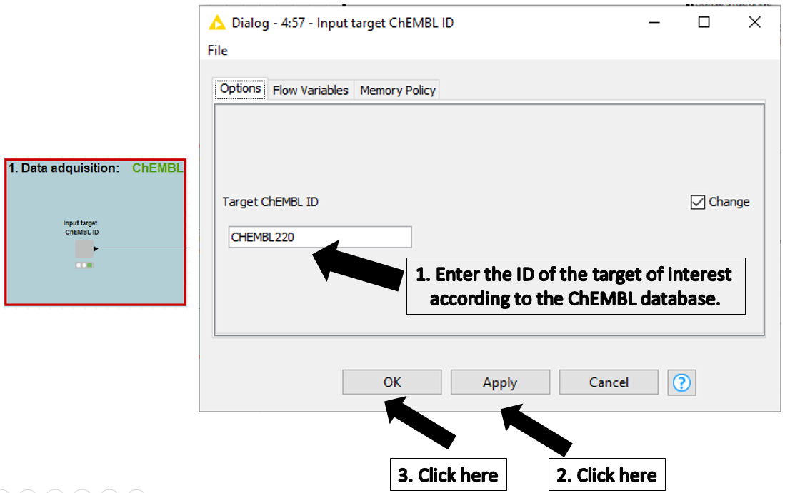
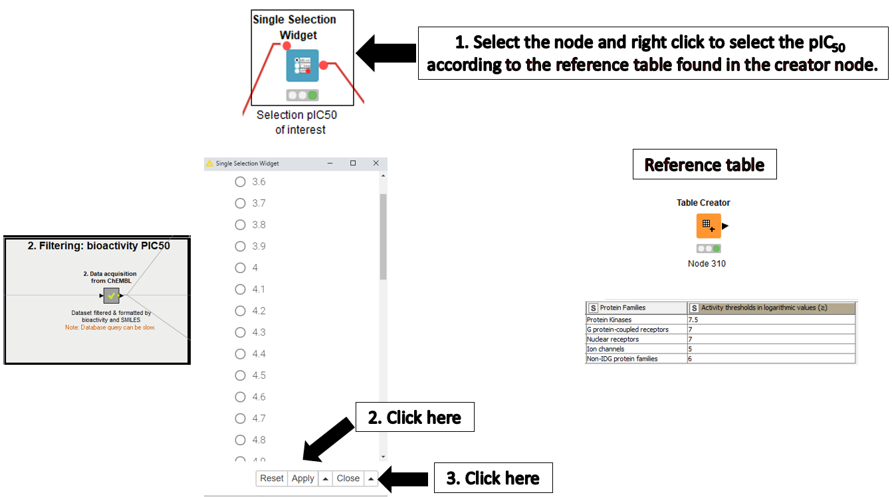
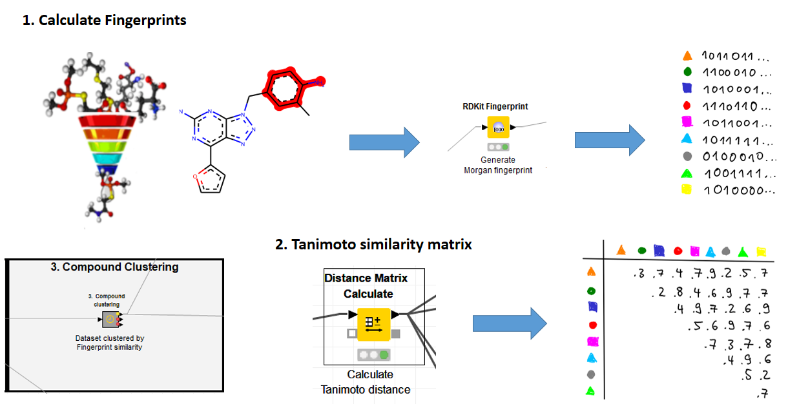
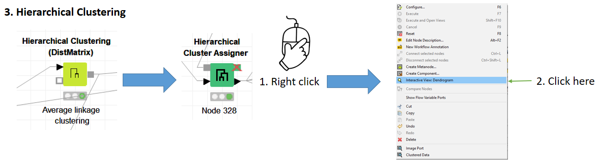
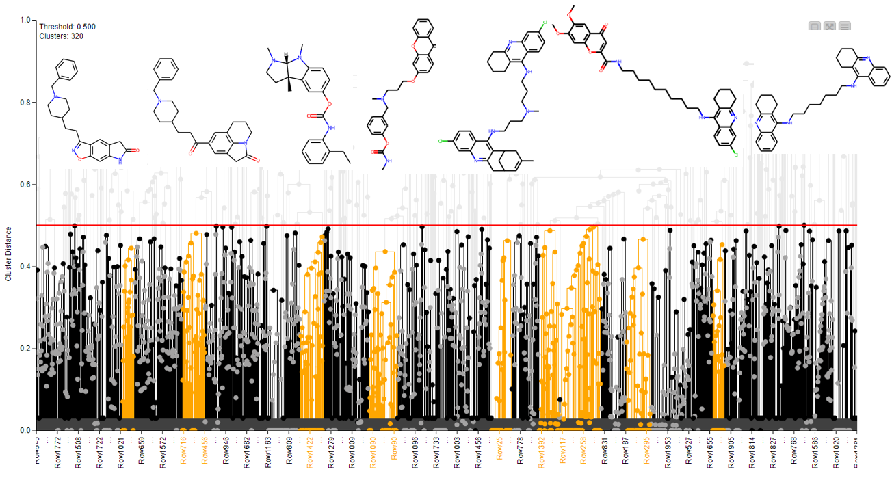
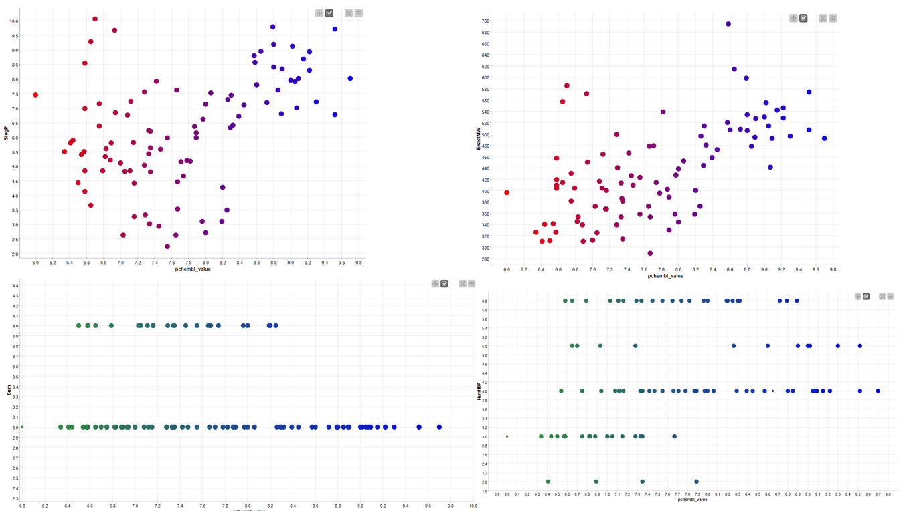
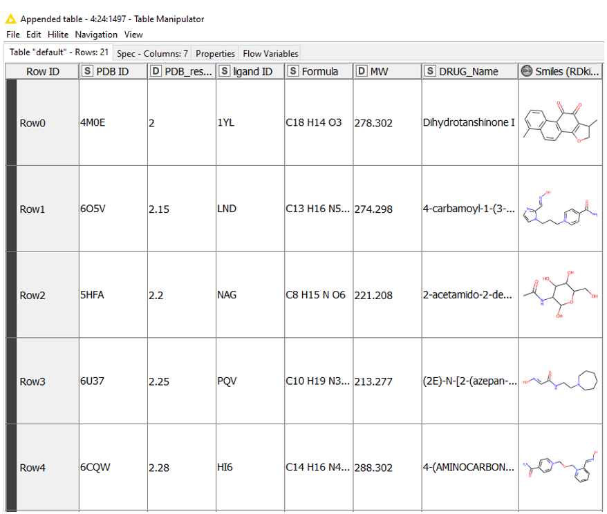
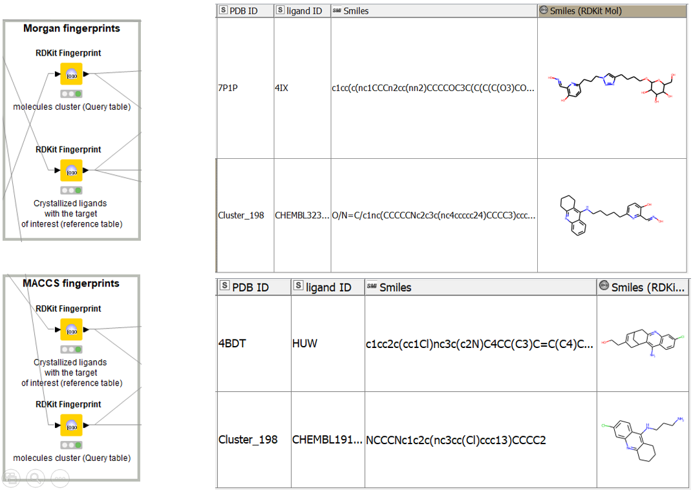

## Chemoinformatics Analysis Tutorial with Knime

In this tutorial, we will work with the <a href="https://www.ebi.ac.uk/chembl" target="_blank"><b>CHEMBL</b></a> database database (07.2021,29) and the open-source software KNIME, which will allow us to acquire the data of interest of the compounds that have been tested against a given target (in this particular case it will be for acetylcholinesterase  **(ACHE)** and filter them, according to the available bioactivity data pIC 50.  Subsequently, this data set will be used to perform chemoinformatics tasks such as clustering, evaluation of Lipinski's rule of five, querying the Protein Data Bank (PDB) database to determine the ligands that are co-crystallized with high resolution on the target of interest, and searching for similarities between compounds. 

### Requirements

+ Knime version 4.3.1, an open source software for data analysis <b><a href="https://www.knime.com/" target="_blank">Knime website</a></b>
+ Our Knime workflow to download and run, <a href="https://github.com//jdhurtadop2017/Chemoinformatics-Analysis-Tutorial-with-Knime/raw/master/chemo_Tutorial.knar.knwf">**chemo_Tutorial**</a>.
+ Here you can have a complete visualization of the workflow <a href="https://tutorial-chemoinformatics-knime.netlify.app/" target="_blank">**Workflow Visualization**</a>.

### **<u>This Workflow consists of 6 blocks:</u>**

**1. Data acquisition  and Filtering for bioactivity pIC50**

In the first and second blocks of this workflow, we will acquire the data of the bioactive molecules with drug-like properties for the target of interest, selecting the ID, in this case, **CHEMBL220** then we will connect to the <a href="https://www.ebi.ac.uk/chembl" target="_blank"><b>CHEMBL</b></a>  database through an API to obtain and download the bioactivity data, to finally preprocess and filter the compounds and classify them as active and inactive according to the activity threshold value (pIC50) defined by the  <a href="https://druggablegenome.net/" target="_blank"><b> Illuminating the Druggable Genome (IDG)</b></a> consortium for each protein family.

**2.  Compound Clustering** 

In block three we group active compounds according to the chemical structural similarity between compounds to find groups that share a common scaffold, as well as to select a diverse and representative set for further analysis. So compounds are coded as fingerprints and their similarity can be described by the Tanimoto coefficient. The value of the Tanimoto coefficient varies from zero (no similarity) to one (high similarity). Finally, we will use the hierarchical clustering algorithm to identify groups of similar compounds and select representative compounds from each cluster to create a library of representative compounds. The clustering results can be observed through the dendrogram, which can give us an initial idea of the optimal number of clusters in our partition of the data set, however, it is recommended to use the <a href="https://www.rdocumentation.org/packages/NbClust/versions/3.0/topics/NbClust" target="_blank"><b>NbClust</b></a>   package of R which provides 30 indices to determine the number of clusters and proposes to the user the best clustering scheme from the different results obtained by varying all combinations of several clusters, distance measures, and clustering methods.

**3. Molecular filtering: ADME criteria**

In block four we will work with each of the representative clusters of the data set and filter the molecules by their physicochemical properties, using Lipinski's rule of five **(Ro5)** to keep only the orally bioavailable compounds. The results on the compliance with **Ro5** will be visible through different interactive graphs and we will have an average value of hydrogen donor and acceptor bonds for our set of compounds, e.g. to perform the pharmacophore hypothesis in the next instance.

**4. Protein data acquisition: Protein Data Bank (PDB)**

In block five we will obtain all the IDs from the <a href="https://www.rcsb.org/"><b>PDB</b></a> database for the target of interest (ACHE) that have ligands with high resolution. To perform the <a href="https://www.rcsb.org/"><b>PDB</b></a> query we will use the <a href="https://www.uniprot.org/uniprot/P22303"><b>Uniprot ID</b></a>  of the target of interest, in this case for ACHE it is **P22303** and we will obtain all the structures resolved by x-ray crystallography and we will filter the structures that have ligand with molecular weight higher than 100 g/mol.

**5. Structural similarity between the cluster and the ligands crystallized in PDB.**

Taking into account the output of blocks 4 and 5 we want to search in each representative cluster, if there is already in the <a href="https://www.rcsb.org/"><b>PDB</b></a> database any compound that is already cocrystallized with the target of interest or otherwise determine the compound that has more similarity with an already cocrystallized ligand, to achieve this goal we have implemented block 6. 

**6. Citation**

* Hurtado-Pachon, Jonathan; Peña-Varas, Carlos; Ramírez, David. Chemoinformatics analysis for computer-aided drug design (CADD). Santiago, Chile; 2021.